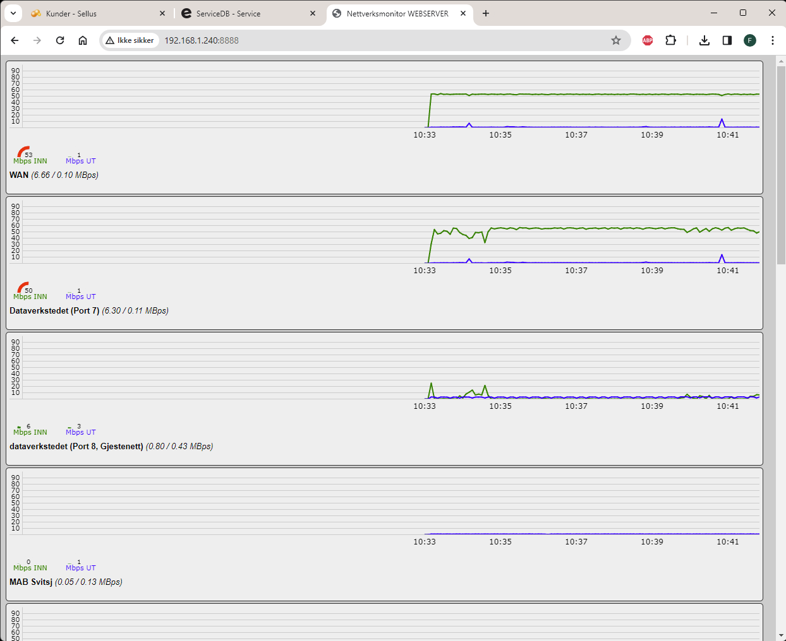

## Nettverksmonitor

 

En nettverksmonitor for lokalnettverk for visning av trafikk fra bl.a. switcher og brannmurer.  
Benytter SNMP v2c (public) via Net-SNMP 5.9.4 biblioteket. I verste fall kanskje siste runtime på helt nye systemer.  

**Bruk:**  
Man installerer på en Windows maskin som skal fungere som vert, les og sett opp konfigurasjon.ini, start og koble til port i en nettleser.  

Maskinen eller serveren det blir installert på trenger åpen inngang til angitt port i konfigurasjonsfilen, 
standard 8888, dersom andre maskiner i nettverket skal få tilgang til trafikkoversikten/WebUI i sin nettleser.  

**WebUI**  
IP:PORT i hvilken som helst nyere nettleser som støtter JavaScript.  
Grafene sorteres automatisk etter trafikkaktivitet, basert på INN+UT samtidig.  

**konfigurasjon.ini**  
Angi port, mellomlagerstørrelse og porter som skal skannes.  
Filen inneholder standardverdier og eksempelporter fra et ekte oppsett som illustrert i eksempelbildet ovenfor.

**Eksempelinnhold:**  

	; Porten som web UI skal lytte på. Denne endringen krever omstart av programmet.
	; WebUI blir som standard tilgjengelig via nettleser på http://localhost:8888/
	SERVER_PORT=8888

	; Hvor mange datasett som skal holdes bufret og sendes for visning til UI.
	; Ett datasett inneholder de siste INN/UT byte-verdiene for hver eneste SNMP enhet.
	; Dette betyr i praksis hvor lang historikk man vil ha / hvor mye UI skal kunne vise.
	TRAFIKKBUFFER_ANTALL=1000

	; Denne filen benytter seg av følgende format:
	; IP : INTERFACEPORT : PORTALIAS : TITTEL

	; INTERFACEPORT er egne portnavn hos SNMP agent. Søk etter i cmd (som admin!):
	; C:\> cd "C:\Program Files\Nettverksmonitor"
	; C:\> snmpbulkwalk.exe -M ".\mibs" -c public -v2c IP.SOM.SKAL.SKANNES ifDescr

	; PORTALIAS er porten man vanligvis gjenkjenner selv (f.eks. eth1,2,3).
	; TITTEL velger man selv. Programmet hopper over de som ikke er satt til noe.

	; Legg til eller endre datalinjer nedenfor etter ønske og behov.
	; MERK: Navn som har _reverse bak seg får INN/UT visning reversert.
	; Dette er nyttig f.eks. fra svitsjer hvor INN/UT kan ønskes omvendt.

	; Første graf blir festet på toppen, beregnet for WAN.
	192.168.1.1:3:1:WAN

	; Alle andre blir automatisk sortert i sanntid etter trafikkmengde (inn+ut).
	192.168.1.1:13:2:dataverkstedet (Port 8, Gjestenett)_reverse
	192.168.1.250:49153:1:
	192.168.1.250:49157:5:
	192.168.1.250:49158:6:Mottak_reverse
	192.168.1.250:49159:7:Kasse 1_reverse
	192.168.1.250:49160:8:Frode's Kontor_reverse